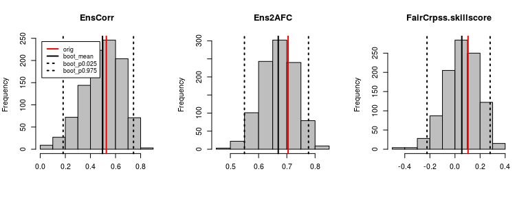

<!-- README.md is generated from README.Rmd. Please edit that file -->
ForecastMoments
===============

The joint forecast observation distribution for Gaussian variables can be described with 6 low-order moments. 'ForecastMoments' provides functions to compute these moments, and to interpret forecast quality using a signal-plus-noise model based on these low-order moments. Uncertainty assessment of these moments and derived forecast quality information including traditional verification scores and skill scores is provided based on parametric bootstrap resampling.

Installation
------------

The package can be installed from github.

``` r
library(devtools)
install_github("jonasbhend/ForecastMoments")
```

Example
-------

This is a basic example which shows you how to solve a common problem:

``` r
library(ForecastMoments)
#> Loading required package: easyVerification
#> Loading required package: SpecsVerification
#> 
#> Attaching package: 'easyVerification'
#> The following object is masked from 'package:SpecsVerification':
#> 
#>     EnsCorr

tm <- easyVerification::toymodel()
tmboot <- SNRresample(tm$fcst, tm$obs, c("EnsCorr", "Ens2AFC", "FairCrpss"))

summary(tmboot)
#>                               orig  boot_mean    boot_sd boot_p0.025
#> EnsCorr                 0.52663157 0.49627656 0.15010587  0.18242548
#> Ens2AFC                 0.70454574 0.66963512 0.05926459  0.54985062
#> FairCrpss.skillscore    0.10409977 0.05451122 0.13206492 -0.22295674
#> FairCrpss.skillscore.sd 0.09782066 0.12859667 0.03204040  0.07687236
#>                         boot_p0.975
#> EnsCorr                   0.7433533
#> Ens2AFC                   0.7767993
#> FairCrpss.skillscore      0.2799730
#> FairCrpss.skillscore.sd   0.2068374
```

``` r
boots <- summary(tmboot)
par(mfrow=c(1,nrow(boots) - 1)) 
tmp <- sapply(seq(1,nrow(boots)-1), function(i){
  hist(tmboot[i,-1], col='grey', main=rownames(tmboot)[i], xlab='')
  abline(v=boots[i,-3], lwd=2, lty=c(1,1,3,3), col=c(2,1,1,1))
  if (i == 1) legend("topleft", legend=colnames(boots)[-3], 
                     lwd=2, col=c(2,1,1,1), lty=c(1,1,3,3), 
                     cex=0.83, inset=0.05)
})
```


